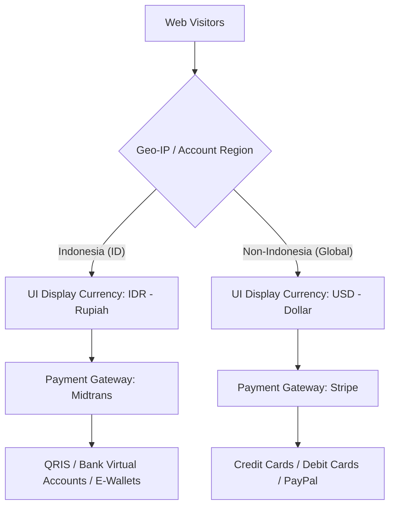

# Business Requirement Document (BRD): Phanilie Music Platform

**Product Name**: Phanilie Music & Learning Platform  
**Document**: Business Requirement Document (BRD)  
**File Location**: `docs/BRD.md`  
**Date**: July 29, 2026  
**Status**: Approved & Ratified  
**Related Documents**: [PRD.md](file:///d:/phanilie-new/PRD.md) | [specs/](file:///d:/phanilie-new/specs/)

---

## 1. Background & Business Vision

### 1.1 Strategic Vision
Position **Phanilie Music Platform** as the premier digital music learning platform and sheet music marketplace for both the **Indonesian local market** and the **global international market**.

### 1.2 Business Problem & Integrated Solution

| Business Problem | Business Impact | Strategic Solution |
| :--- | :--- | :--- |
| **Digital Sheet Music Piracy** | Revenue loss for composers & platform due to unauthorized PDF sharing. | **Dynamic Buyer Watermarking**: Stamping buyer name & email permanently on every downloaded PDF footer. |
| **Cross-Border Payment Friction** | International buyers fail checkout via local gateways; Indonesian buyers struggle with global gateways. | **Dual Currency & Dual Gateways**: Geo-IP detection offering IDR via Midtrans & USD via Stripe. |
| **Low Student Learning Retention** | Students lose motivation and cancel subscriptions on traditional learning platforms. | **Gamified Learning Board**: Tracking practice intensity, progress %, custom student to-do lists, and accomplishment badges. |
| **Pre-Purchase Hesitation** | Potential buyers cannot evaluate course or sheet music quality before paying. | **Freemium Preview Model**: Free exploration of course structures & 30-second audio/MIDI previews for sheet music. |

---

## 2. Business Model & Revenue Streams

Phanilie Music Platform employs a hybrid revenue model combining **Recurring Subscriptions** and **Direct Transactional Sales**:

### 2.1 Stream 1: Membership Subscriptions (Recurring Revenue)
Full access to all video courses, lesson sheet music PDFs, and live masterclass sessions.
* **Monthly Plan**: IDR for Indonesia / USD for Global.
* **Quarterly Plan**: Mid-tier discounted plan.
* **Annual Plan**: Best value for long-term retention.

### 2.2 Stream 2: Direct Sheet Music E-Commerce Sales (Transactional Revenue)
Individual sheet music purchases for non-subscribers or students who wish to own specific digital scores.
* Dual pricing stored in database (`Price_IDR` and `Price_USD`).
* Permanent ownership displayed in the student's **My Library**.

### 2.3 Stream 3: Live Masterclass & Community Sessions
An exclusive value-add feature for active members to participate in live masterclass streams and access session recordings.

---

## 3. Market Segmentation & Payment Integration

### 3.1 Local Indonesian Market (IDR - MVP Focus)
* **Target Audience**: Music students, hobbyists, and piano teachers in Indonesia.
* **Currency**: Indonesian Rupiah (IDR).
* **Payment Methods**: QRIS (ShopeePay, GoPay, Dana, OVO), Virtual Bank Accounts (BCA, Mandiri, BNI, BRI).
* **Gateway**: Midtrans Indonesia (**Active in MVP**).

### 3.2 International Global Market (USD - Post-MVP Expansion)
* **Target Audience**: International music enthusiasts, expatriates, and global students.
* **Currency**: United States Dollar (USD).
* **Payment Methods**: Visa, Mastercard, American Express, PayPal.
* **Gateway**: Stripe International (**Planned for Post-MVP Phase**).

---

## 4. Operational Rules & Business Governance

### 4.1 Freemium & Paywall Access Policy
1. Unauthenticated visitors and non-subscriber users are permitted to browse `/courses`, view levels, topics, and lesson metadata.
2. Upon attempting to stream lesson videos or download lesson PDFs, the system **MUST block access** (`403 Forbidden`) and present membership plan upgrade options.

### 4.2 Intellectual Property Protection Policy
1. All PDF sheet music files downloaded from **My Library** MUST feature a permanent footer watermark on every page:  
   `"Purchased by: [Buyer Name] ([Buyer Email]) on Phanilie Music Platform"`.
2. Download links use short-lived signed URLs to prevent public link sharing.

### 4.3 User Role Access Control Policy
* **Guest**: Public browsing and adding items to cart.
* **Student (Free)**: Custom To-Do List management, purchasing sheet music, accessing My Library.
* **Subscriber (Active Paid)**: Full Student privileges + unrestricted access to Video Courses & Live Masterclasses.
* **Admin**: Platform manager (Full CRUD across all content, order management, contact form responses, newsletter management).

---

## 5. Key Performance Indicators (KPIs)

1. **Conversion Rate (Freemium to Paid Member)**: Target conversion rate from free visitors to paid subscribers exceeding **> 5%**.
2. **Sheet Music Cart Checkout Rate**: Checkout completion rate above **70%** enabled by comprehensive local payment methods.
3. **Student Retention Rate**: Monthly renewal rate above **80%** driven by Learning Board gamification features.
4. **Zero Piracy Leakage**: 100% of downloaded PDF sheet music files dynamically stamped with valid buyer details.

---

## 6. Business-to-Technical Mapping (Spec Modules 000-013)

| Business Requirement (BRD) | Technical Execution Module | Specification File |
| :--- | :--- | :--- |
| Database Infrastructure & Initial Super Admin | SPEC-000 | [spec.md](file:///d:/phanilie-new/specs/000-core-database-infrastructure/spec.md) |
| Global Navigation & Search Bar | SPEC-001 | [spec.md](file:///d:/phanilie-new/specs/001-global-search/spec.md) |
| Freemium Course Model & Paywall Security Guard | SPEC-002 | [spec.md](file:///d:/phanilie-new/specs/002-freemium-course-exploration/spec.md) |
| Dual Currency & Midtrans/Stripe Gateways | SPEC-003 | [spec.md](file:///d:/phanilie-new/specs/003-pricing-localization-payments/spec.md) |
| Visitor Communication & Support Inquiries | SPEC-004 | [spec.md](file:///d:/phanilie-new/specs/004-contact-form/spec.md) |
| Email Marketing & Newsletter Subscriptions | SPEC-005 | [spec.md](file:///d:/phanilie-new/specs/005-newsletter-subscription/spec.md) |
| Student Learning Gamification & Retention | SPEC-006 | [spec.md](file:///d:/phanilie-new/specs/006-student-learning-board/spec.md) |
| Sheet Music Store & Performance Cover Catalog | SPEC-007 | [spec.md](file:///d:/phanilie-new/specs/007-covers-and-sheets-catalog/spec.md) |
| IP Protection & Dynamic PDF Watermarking | SPEC-008 | [spec.md](file:///d:/phanilie-new/specs/008-my-library/spec.md) |
| Live Streaming Masterclass & Video Archives | SPEC-009 | [spec.md](file:///d:/phanilie-new/specs/009-live-masterclass/spec.md) |
| E-Commerce Shopping Cart & Guest Cart Sync | SPEC-010 | [spec.md](file:///d:/phanilie-new/specs/010-shopping-cart/spec.md) |
| Account Security & Regional User Localization | SPEC-011 | [spec.md](file:///d:/phanilie-new/specs/011-auth-and-country-localization/spec.md) |
| Operational Control Panel & Admin Management | SPEC-012 | [spec.md](file:///d:/phanilie-new/specs/012-admin-crud-management/spec.md) |
| Media Storage & Digital Asset Management | SPEC-013 | [spec.md](file:///d:/phanilie-new/specs/013-media-file-storage/spec.md) |
