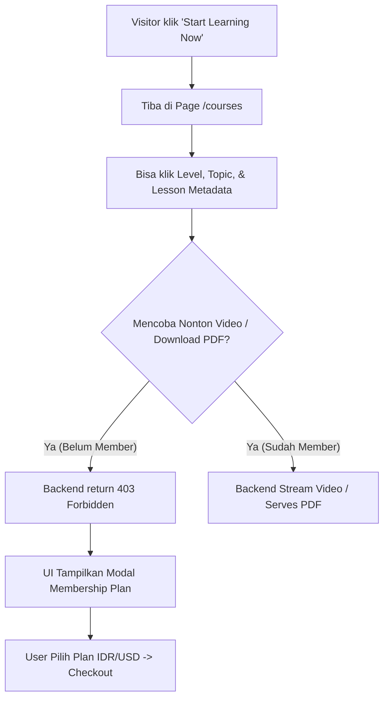
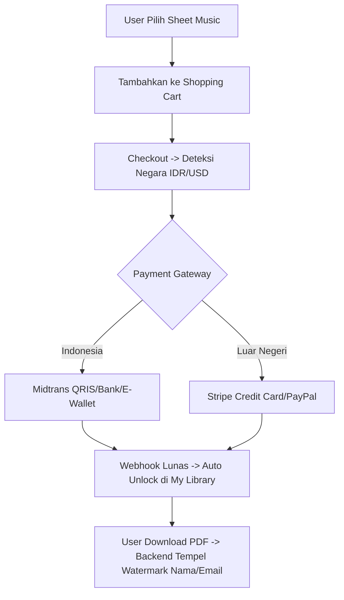

# Product Requirement Document (PRD): Phanilie Music Platform

**Nama Proyek**: Phanilie Music & Learning Platform  
**Versi**: 1.0.0  
**Tanggal**: 29 Juli 2026  
**Status**: Approved & Ready for Implementation  
**Dokumen Referensi**: [specs/](file:///d:/phanilie-new/specs/)

---

## 1. Overview & Visi Produk

**Phanilie Music Platform** adalah platform hibrida *Edutech* dan *E-Commerce* musik premium yang memadukan:
1. **Kursus Pembelajaran Musik (Freemium Model)**: Pembelajaran berbasis level, topik, dan video pelajaran interaktif.
2. **Toko Digital Sheet Music**: Penjualan lembaran musik digital yang dilengkapi *dynamic buyer watermarking* untuk pencegahan pembajakan.
3. **Papan Belajar Siswa (Learning Board)**: Dashboard gamifikasi yang mencatat progres belajar, durasi latihan mingguan, *to-do list* mandiri, dan lencana pencapaian (*badges*).
4. **Komunitas Live Masterclass**: Sesi kelas langsung interaktif dan arsip rekaman video.
5. **Lokalisasi Ganda (Mata Uang & Payment Gateway)**: Penyesuaian otomatis Rupiah (IDR) via Midtrans untuk pengguna Indonesia dan Dolar (USD) via Stripe untuk pengguna luar negeri.

---

## 2. Target Pengguna (User Personas)

1. **Visitor / Tamu Non-Member**: Pengunjung baru yang ingin menjelajahi katalog lagu, mencoba struktur kursus, dan melihat *covers*.
2. **Siswa Terdaftar (Student)**: Pengguna gratis yang telah mendaftar akun, dapat mengelola *To-Do List*, dan membeli Sheet Music.
3. **Siswa Langganan (Subscriber)**: Siswa berbayar (Monthly/Quarterly/Annual) yang mendapatkan akses penuh ke seluruh video pelajaran, PDF Sheet Music kursus, dan link sesi Live Masterclass.
4. **Pengelola (Admin)**: Pengelola platform yang memiliki hak akses penuh (*Full CRUD*) untuk mengunggah materi, mengelola lagu, memantau transaksi, serta mengurus pesan dan newsletter.

---

## 3. Ringkasan Arsitektur & Teknologi

* **Backend**: C# / ASP.NET Core 10 Web API (`net10.0`)
* **ORM & Database**: Entity Framework Core 10 (`Npgsql`) & PostgreSQL (Supabase / Cloud)
* **Frontend**: React + Vite (JavaScript / TypeScript, Vanilla CSS)
* **Autentikasi**: JWT (JSON Web Token) dengan Refresh Token & BCrypt Password Hashing
* **Keamanan Media**: Dynamic PDF Watermarking (`PdfSharpCore` / `iText7`) & Short-Lived Signed Download URLs
* **Payment Gateways**:
  * **Indonesia (IDR)**: Midtrans (QRIS, Bank Transfer, E-Wallet)
  * **Global / Luar Negeri (USD)**: Stripe (Credit/Debit Card, PayPal)
* **Storage**: Local Disk & Supabase Storage API

---

## 4. Matriks Modul & Fitur (14 Spec Modules)

Seluruh fitur teknis telah terbagi secara modular dalam 14 spesifikasi:

| Kode Modul | Nama Modul | Deskripsi Singkat | Link Spesifikasi |
| :--- | :--- | :--- | :--- |
| **SPEC-000** | Core DB Infrastructure | Schema EF Core PostgreSQL, Auto Migration, & Data Seeding Super Admin | [spec.md](file:///d:/phanilie-new/specs/000-core-database-infrastructure/spec.md) |
| **SPEC-001** | Global Navbar Search | Pencarian instan pencocokan judul Video, Covers, dan Sheet Music | [spec.md](file:///d:/phanilie-new/specs/001-global-search/spec.md) |
| **SPEC-002** | Freemium Course Exploration | Eksplorasi materi publik & Paywall lock untuk Video/PDF non-member | [spec.md](file:///d:/phanilie-new/specs/002-freemium-course-exploration/spec.md) |
| **SPEC-003** | Multi-Currency & Payments | Deteksi negara (IDR/USD) & integrasi Midtrans + Stripe | [spec.md](file:///d:/phanilie-new/specs/003-pricing-localization-payments/spec.md) |
| **SPEC-004** | Contact Phanilie Form | Form pesan footer, database persistence, & rate limiting | [spec.md](file:///d:/phanilie-new/specs/004-contact-form/spec.md) |
| **SPEC-005** | Newsletter Subscription | Pendaftaran email newsletter & token unsubscribe | [spec.md](file:///d:/phanilie-new/specs/005-newsletter-subscription/spec.md) |
| **SPEC-006** | Student Learning Board | Progress %, Weekly Practice intensity, Student To-Do CRUD, & Badges | [spec.md](file:///d:/phanilie-new/specs/006-student-learning-board/spec.md) |
| **SPEC-007** | Covers & Sheets Catalog | Katalog Video Covers & Sheet Music (lengkap dengan Audio Preview) | [spec.md](file:///d:/phanilie-new/specs/007-covers-and-sheets-catalog/spec.md) |
| **SPEC-008** | My Library & Watermarking | Perpustakaan digital sheet music milik user & PDF buyer watermark | [spec.md](file:///d:/phanilie-new/specs/008-my-library/spec.md) |
| **SPEC-009** | Live Masterclass | Jadwal live kelas subscriber & arsip rekaman video | [spec.md](file:///d:/phanilie-new/specs/009-live-masterclass/spec.md) |
| **SPEC-010** | Shopping Cart | Keranjang belanja Sheet Music & sync item tamu saat login | [spec.md](file:///d:/phanilie-new/specs/010-shopping-cart/spec.md) |
| **SPEC-011** | Auth & Localization | Auth lengkap (Sign Up/In, Forgot Password) & User Country claims | [spec.md](file:///d:/phanilie-new/specs/011-auth-and-country-localization/spec.md) |
| **SPEC-012** | Admin Panel & Full CRUD | Control panel terproteksi role Admin untuk mengelola seluruh platform | [spec.md](file:///d:/phanilie-new/specs/012-admin-crud-management/spec.md) |
| **SPEC-013** | Media & File Storage | Service upload & manajemen file fisik (PDF, MP3, Image, MP4) | [spec.md](file:///d:/phanilie-new/specs/013-media-file-storage/spec.md) |

---

## 5. Alur Pengguna Utama (User Journeys)

### Journey A: Eksplorasi Kursus & Konversi Langganan (Freemium Paywall)

### Journey B: Pembelian Sheet Music & My Library Watermarking

---

## 6. Persyaratan Non-Fungsional (Non-Functional Requirements)

1. **Performa**: Waktu respon API rata-rata di bawah **200ms (p95)** untuk pencarian dan pengambilan katalog.
2. **Keamanan**:
   * Token JWT menggunakan alogritma HMAC-SHA256 dengan *Refresh Token* tersimpan aman.
   * Password di-hash menggunakan BCrypt dengan *work factor* yang aman.
   * Endpoint Admin dilindungi penuh oleh sistem Role-Based Access Control (RBAC).
   * URL Download Sheet Music menggunakan token sementara berjangka waktu pendek (*Signed URL*) untuk mencegah *link sharing* ilegal.
3. **Integritas Data Digital**:
   * PDF Sheet Music yang diunduh wajib stempel watermark permanen: `"Purchased by: [User Name] ([User Email]) on Phanilie Music"`.
4. **Ketersediaan (Availability)**:
   * Backend stateless yang siap di-deploy ke server container/cloud (Render, Railway, Docker, atau IIS).

---

## 7. Tahapan Pelaksanaan (Implementation Roadmap)

* **Fase 1: Infrastructure & DB Setup** (`SPEC-000`, `SPEC-013`)
  * Setup EF Core PostgreSQL, database migrations, seeding Super Admin, dan File Storage Service.
* **Fase 2: Auth, Users & Course Exploration** (`SPEC-011`, `SPEC-002`, `SPEC-001`)
  * Auth JWT, Freemium course APIs, Paywall lock filter, dan Global Search bar.
* **Fase 3: E-Commerce, Watermarking & Payments** (`SPEC-007`, `SPEC-010`, `SPEC-003`, `SPEC-008`)
  * Katalog Sheet Music, Shopping Cart, Webhook Midtrans & Stripe, My Library, dan PDF Watermarking.
* **Fase 4: Student Engagement & Masterclass** (`SPEC-006`, `SPEC-009`, `SPEC-004`, `SPEC-005`)
  * Student Learning Board (Progress %, To-Do CRUD, Badges), Live Masterclass, Contact Form, dan Newsletter.
* **Fase 5: Admin Panel & End-to-End Polish** (`SPEC-012`)
  * Admin CRUD APIs untuk seluruh entitas, verifikasi pengujian, dan persiapan rilisan *production*.
