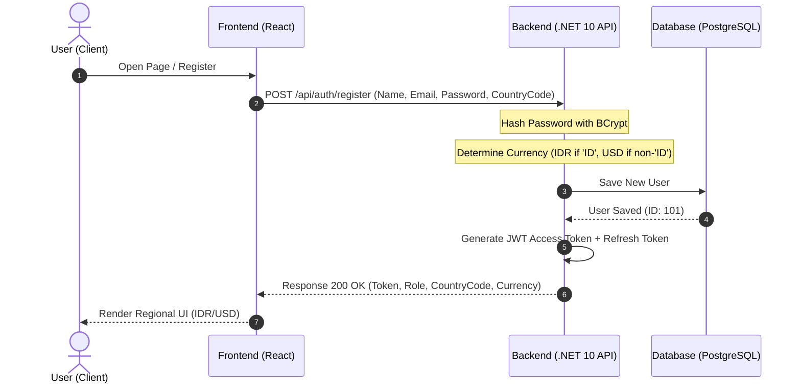
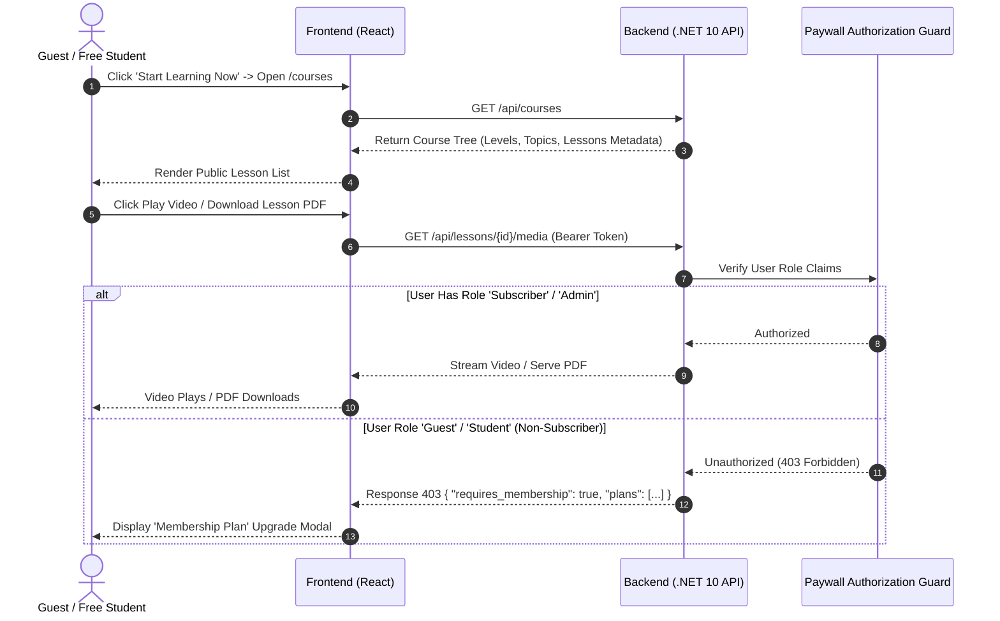
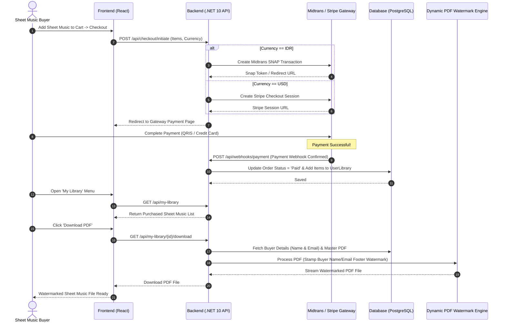
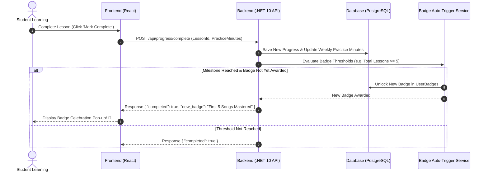

# System Architecture & Data Flows

**Document**: System Architecture, Internal/External Tech Stack, and Data Pipelines  
**File Location**: `docs/SYSTEM_ARCHITECTURE.md`  
**Date**: July 29, 2026  
**Status**: Approved Architecture  
**Related Documents**: [PRD.md](file:///d:/phanilie-new/PRD.md) | [BRD.md](file:///d:/phanilie-new/docs/BRD.md) | [specs/](file:///d:/phanilie-new/specs/)

---

## 1. Internal & External Technology Matrix

The **Phanilie Music Platform** architecture seamlessly connects internal backend services with external third-party services:

```text
┌──────────────────────────────────────────────────────────────────────────────────┐
│                            FRONTEND (React + Vite)                               │
└────────────────────────────────────────┬─────────────────────────────────────────┘
                                         │ REST API / JSON (HTTPS)
                                         ▼
┌──────────────────────────────────────────────────────────────────────────────────┐
│                      BACKEND (C# / ASP.NET Core 10 Web API)                      │
│                                                                                  │
│  [JWT Auth & Middleware]  -->  [Controllers & Services]  -->  [EF Core 10 ORM]    │
│  [PDF Watermark Engine]   -->  [Geo-IP & Dual Currency]  -->  [Rate Limiter]       │
└──────────────┬─────────────────────────┬─────────────────────────┬───────────────┘
               │                         │                         │
               ▼                         ▼                         ▼
┌──────────────────────────┐ ┌───────────────────────┐ ┌──────────────────────────┐
│   DATABASE & STORAGE     │ │   PAYMENT GATEWAYS    │ │  COMMUNICATION SERVICES  │
│                          │ │                       │ │                          │
│  • PostgreSQL            │ │  • Midtrans (IDR)     │ │  • SendGrid / SMTP       │
│  • Supabase DB Cloud     │ │  • Stripe (USD)       │ │    (OTP, Reset Token,    │
│  • Supabase Media Bucket │ │                       │ │     Auto-Reply Emails)   │
└──────────────────────────┘ └───────────────────────┘ └──────────────────────────┘
```

### 1.1 Technology Specification Table

| Category | Technology | Type | Primary Role |
| :--- | :--- | :--- | :--- |
| **Backend Framework** | **ASP.NET Core 10 Web API** | Internal | Business logic, REST API endpoints, routing, CORS, and security middleware. |
| **ORM / Data Access** | **Entity Framework Core 10 (`Npgsql`)** | Internal | Connects C# code to PostgreSQL (*Code-First Migrations* & encrypted queries). |
| **Database Engine** | **PostgreSQL** | Internal / Cloud | Relational data persistence (User, Order, Course, Lesson, SheetMusic, Progress, Badges). |
| **Cloud Database Host** | **Supabase DB** | External Cloud | Managed 24/7 PostgreSQL cloud database hosting. |
| **Media Object Storage** | **Supabase Storage / Local Disk** | Internal / External | Asset storage for Sheet Music PDFs, Cover images, and 30-second audio previews. |
| **PDF Processing** | **PdfSharpCore / iText7** | Internal Library | Dynamically stamps buyer name & email watermark onto PDF footers during download. |
| **Auth & Security** | **JWT Bearer & BCrypt.Net** | Internal | Issues authentication tokens, hashes passwords, and enforces Role-Based Access Control (RBAC). |
| **Payment Gateway IDR** | **Midtrans API & SNAP** | External API | Processes Indonesian Rupiah payments (QRIS, BCA, Mandiri, GoPay, OVO). |
| **Payment Gateway USD** | **Stripe API** | External API | Processes international USD payments (Credit Cards, Debit Cards, PayPal). |
| **Email Gateway** | **SendGrid / SMTP Server** | External Service | Dispatches email verification, OTP password reset tokens, and contact auto-replies. |

---

## 2. Visual System Flows (Mermaid Diagrams)

### 2.1 Authentication & Country Localization Flow

This diagram illustrates Geo-IP location detection, currency assignment, and secure JWT token issuance.



---

### 2.2 Freemium Course Exploration & Paywall Security Guard Flow

This diagram demonstrates how paid media content is secured at the backend API level.



---

### 2.3 Sheet Music E-Commerce, Dual Gateway Webhook, & PDF Watermarking Flow

This diagram details the transaction flow from sheet music selection, Midtrans/Stripe payment processing, to downloading dynamically watermarked PDFs.



---

### 2.4 Student Learning Board & Auto-Badge Trigger Flow

This diagram demonstrates how student learning progress is recorded and triggers badge auto-unlocks.



---

## 3. Media Security & Delivery Pipeline

To ensure digital sheet music and course videos remain secure against piracy:

```text
┌─────────────────────────────────────────────────────────────────────────────────┐
│                      MEDIA ASSETS PROTECTION PIPELINE                           │
├─────────────────────────────────────────────────────────────────────────────────┤
│                                                                                 │
│  [1. Request Media]  ──►  [2. Validate JWT & Subscription Claims]               │
│                                           │                                     │
│                                           ▼                                     │
│  [4. Dynamic Injection] ◄── [3. Generate Temporary Signed URL (Expires in 5m)]  │
│       • PDF: Inject Footer Buyer Watermark Text                                 │
│       • Video: Stream HLS / Secure Byte Chunks                                  │
│                                           │                                     │
│                                           ▼                                     │
│  [5. Deliver Binary Stream directly to Client Browser (No Static Paths Exposed)]│
└─────────────────────────────────────────────────────────────────────────────────┘
```
