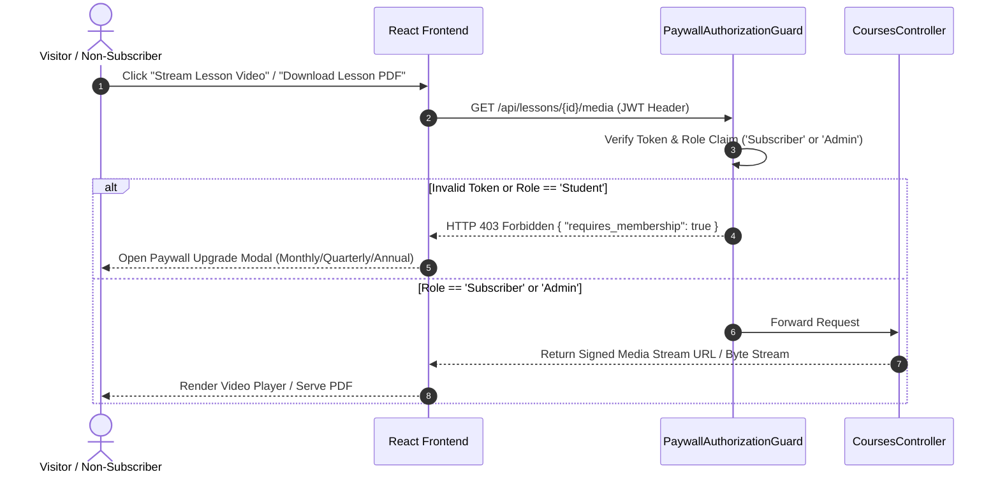
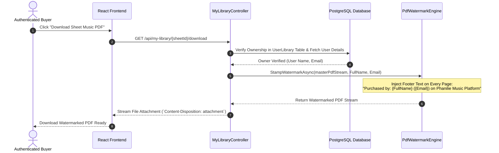

# Master Implementation Plan: Phanilie Music Platform

**Document**: Master Implementation Plan (`plan.md`)  
**Scope**: Enterprise Technical Stack, Architecture, Data Pipelines & Implementation Roadmap  
**Status**: Approved Technical Architecture  
**Target Workflow**: `/speckit.plan`  

---

## 1. Selected Tech Stack & Architecture Choices

### 1.1 Core Backend & Infrastructure Architecture
* **Runtime & Framework**: ASP.NET Core 10 Web API (`net10.0`, C# 13).
* **ORM & Database Provider**: Entity Framework Core 10 (`Npgsql.EntityFrameworkCore.PostgreSQL`).
* **Database Host**: PostgreSQL hosted on Supabase DB Cloud (with connection pooler & failover fallback).
* **Authentication & Cryptography**: JWT Bearer Tokens (HMAC-SHA256), Refresh Tokens stored in DB, `BCrypt.Net-Next` for password hashing.
* **PDF Processing Engine**: `PdfSharpCore` / `iText7` for dynamic byte-stream footer watermarking.
* **Media Asset Storage**: Storage strategy pattern supporting Local Disk Storage and `Supabase.Storage` API.

### 1.2 Frontend & Presentation Architecture
* **Framework & Build**: React 18+ with Vite (JavaScript / TypeScript).
* **Styling**: Vanilla CSS Modules with custom Design System Tokens (Zero Tailwind dependencies).
* **HTTP Client**: Axios with request/response interceptors for automatic JWT header injection and refresh token rotation.
* **State Management**: React Context API (`AuthContext`, `CartContext`, `GeoContext`).

### 1.3 External Service Integration Matrix
* **Indonesian Payments (IDR)**: Midtrans API (`Midtrans.Net` / SNAP API for QRIS, Bank Virtual Accounts, E-Wallets).
* **Global Payments (USD)**: Stripe API (`Stripe.net` for Checkout Sessions, Credit/Debit Cards, PayPal).
* **Email Gateway**: SendGrid API / SMTP Mailer (`MailKit` / `SmtpClient` for auto-replies, OTP password resets, newsletter tokens).

---

## 2. Codebase Architecture & Folder Structure

### 2.1 Backend Layered Clean Architecture (`backend/`)
```text
backend/
├── Controllers/                  # REST Controllers handling routing & HTTP status codes
│   ├── AuthController.cs         # Auth endpoints (Register, Login, Refresh, Logout)
│   ├── CoursesController.cs      # Course curriculum & lesson media endpoints
│   ├── CatalogController.cs      # Sheet music & cover video catalog endpoints
│   ├── CheckoutController.cs     # Midtrans SNAP & Stripe Checkout Session creation
│   ├── WebhooksController.cs     # Midtrans & Stripe payment webhook handlers
│   ├── MyLibraryController.cs    # Purchased library & watermarked PDF download handler
│   ├── ProgressController.cs     # Student progress, practice log, & badge triggers
│   ├── TodoController.cs         # Student practice to-do CRUD
│   ├── SearchController.cs       # Global partial-match search engine
│   ├── ContactController.cs      # Public contact form submission & rate limiting
│   ├── NewsletterController.cs   # Newsletter subscribe & token unsubscribe
│   ├── MasterclassController.cs  # Live masterclass schedule & video archives
│   └── Admin/                    # Role-protected Admin controllers ([Authorize(Roles="Admin")])
│       ├── AdminCoursesController.cs
│       ├── AdminSheetsController.cs
│       ├── AdminOrdersController.cs
│       └── AdminUsersController.cs
├── Data/                         # EF Core Data Context & Seeders
│   ├── AppDbContext.cs           # Main EF Core DbContext containing all DbSets
│   ├── DbInitializer.cs          # Startup auto-migration & Super Admin seeder
│   └── Migrations/               # EF Core migration history
├── Models/                       # Domain Entities
│   ├── User.cs                   # User account, role claims, currency preference
│   ├── Course.cs / Level.cs / Topic.cs / Lesson.cs  # Curriculum hierarchy entities
│   ├── SheetMusic.cs / CoverVideo.cs               # Catalog entities
│   ├── Order.cs / OrderItem.cs                     # E-Commerce transaction models
│   ├── UserLibrary.cs                              # Digital rights & ownership mapping
│   ├── StudentProgress.cs / StudentTodo.cs / UserBadge.cs # Gamification models
│   ├── ContactInquiry.cs                           # Support messages
│   └── NewsletterSubscriber.cs                     # Mailing list records
├── DTOs/                         # Data Transfer Objects for validated input/output payloads
├── Services/                     # Business Logic Layer (SOLID Interfaces & Implementations)
│   ├── Interfaces/
│   │   ├── IAuthService.cs
│   │   ├── IPaymentGateway.cs    # Strategy pattern interface for Midtrans vs Stripe
│   │   ├── IPdfWatermarkEngine.cs# PDF stamping interface
│   │   ├── IStorageService.cs    # File storage strategy interface
│   │   └── IEmailService.cs      # Transactional mailer interface
│   └── Implementations/
│       ├── AuthService.cs
│       ├── MidtransPaymentService.cs
│       ├── StripePaymentService.cs
│       ├── PdfWatermarkEngine.cs
│       ├── LocalStorageService.cs
│       ├── SupabaseStorageService.cs
│       └── EmailService.cs
└── Middleware/                   # Custom HTTP Pipeline Middleware
    ├── PaywallAuthorizationGuard.cs # 403 Forbidden paywall enforcement
    └── GlobalExceptionHandler.cs    # Centralized exception logging & JSON errors
```

### 2.2 Frontend Project Directory Structure (`frontend/`)
```text
frontend/
├── src/
│   ├── components/
│   │   ├── common/               # Navbar, Footer, AudioPlayer, Modals
│   │   ├── courses/              # CourseCard, LessonList, PaywallModal
│   │   ├── library/              # SheetMusicCard, WatermarkedDownloadButton
│   │   └── student/              # LearningBoard, PracticeTracker, BadgeGrid
│   ├── context/                  # AuthContext, CartContext, GeoContext
│   ├── hooks/                    # useSearch, useAudioPreview, useDebounce
│   ├── pages/                    # HomePage, CoursesPage, CatalogPage, CheckoutPage, MyLibraryPage, AdminPage
│   ├── services/                 # Axios API clients (api.js, authApi.js, cartApi.js)
│   └── styles/                   # Design tokens, variables.css, global.css
```

---

## 3. Data Pipelines & Sequence Flow Diagrams

### 3.1 Freemium Paywall Security Pipeline


### 3.2 Dynamic PDF Watermarking Delivery Pipeline


---

## 4. 5-Phase Implementation Roadmap

### Phase 1: Core Database & File Engine Setup (`SPEC-000`, `SPEC-013`)
* Configure EF Core 10 PostgreSQL connection string & `AppDbContext`.
* Build `DbInitializer` for automatic migrations and Super Admin seeding.
* Build `StorageService` for local and Supabase cloud file storage.

### Phase 2: Auth, Geo-Localization & Course Exploration (`SPEC-011`, `SPEC-002`, `SPEC-001`)
* Build JWT authentication, BCrypt password hashing, & Refresh Token rotation.
* Implement Geo-IP location detector assigning currency claims (IDR/USD).
* Build Course tree APIs & `PaywallAuthorizationGuard` middleware.
* Build `GlobalSearch` endpoint supporting partial matching.

### Phase 3: E-Commerce, Watermarking & Dual Gateways (`SPEC-007`, `SPEC-010`, `SPEC-003`, `SPEC-008`)
* Build Sheet Music & Cover Video catalog endpoints with 30-second audio preview handlers.
* Build Shopping Cart state manager with guest-to-user cart migration.
* Integrate Midtrans SNAP API (IDR) & Stripe API (USD) with secure webhook handlers.
* Build `MyLibrary` endpoints and `PdfWatermarkEngine` using `PdfSharpCore`.

### Phase 4: Student Learning Board, Gamification & Masterclass (`SPEC-006`, `SPEC-009`, `SPEC-004`, `SPEC-005`)
* Build Student Learning Board (Progress tracking, To-Do list CRUD, & Badge Auto-Trigger service).
* Build Live Masterclass schedule and recorded archive video streaming APIs.
* Build Contact Form submission, rate limiting, and automated response mailer.
* Build Newsletter subscription and one-click token unsubscription engine.

### Phase 5: Admin Control Panel & Verification (`SPEC-012`)
* Build Admin RBAC panel with Full CRUD across all entities and transaction logs.
* Execute end-to-end integration tests across all 14 modules.
