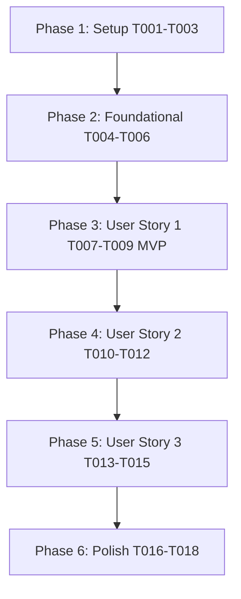

# Tasks: Global Navbar Search (`001-global-search`)

**Input**: Design documents from `/specs/001-global-search/`

**Prerequisites**: [plan.md](file:///D:/Projects%20IT/Project%20IT%20-%20Phanilie-New/specs/001-global-search/plan.md), [spec.md](file:///D:/Projects%20IT/Project%20IT%20-%20Phanilie-New/specs/001-global-search/spec.md), [research.md](file:///D:/Projects%20IT/Project%20IT%20-%20Phanilie-New/specs/001-global-search/research.md), [data-model.md](file:///D:/Projects%20IT/Project%20IT%20-%20Phanilie-New/specs/001-global-search/data-model.md), [search-api.md](file:///D:/Projects%20IT/Project%20IT%20-%20Phanilie-New/specs/001-global-search/contracts/search-api.md)

---

## Phase 1: Setup (Shared Infrastructure)

**Purpose**: Infrastructure setup for search feature components

- [x] T001 [P] Create custom React debouncing hook in `frontend/src/hooks/useDebounce.ts`
- [x] T002 [P] Create recent searches storage hook in `frontend/src/hooks/useRecentSearches.ts`
- [x] T003 [P] Create frontend API service client for search in `frontend/src/services/searchApi.ts`

---

## Phase 2: Foundational (Blocking Prerequisites)

**Purpose**: Core backend DTOs and service interfaces that MUST be complete before user stories can be implemented

- [x] T004 Create backend Search DTO models in `backend/Models/SearchResponseDto.cs`
- [x] T005 Create backend Search Service Interface in `backend/Services/ISearchService.cs`
- [x] T006 Implement database catalog search provider in `backend/Services/SearchService.cs`

---

## Phase 3: User Story 1 - Instant Global Navigation Search (Priority: P1) 🎯 MVP

**Goal**: As a user, typing >= 2 characters into the navbar search input triggers debounced instant catalog matching across Lessons, Covers, and Sheet Music.

**Independent Test**: Typing "Beethoven" in the search input executes a debounced query and displays results within 300ms.

- [x] T007 [US1] Create Backend Search API Endpoint (`GET /api/search`) in `backend/Controllers/SearchController.cs`
- [x] T008 [P] [US1] Implement input debouncing and >= 2 character validation guard in `frontend/src/components/GlobalSearchInput.tsx`
- [x] T009 [US1] Integrate `GlobalSearchInput` into top navigation header in `frontend/src/layout.tsx`

---

## Phase 4: User Story 2 - Categorized Results & Navigation (Priority: P2)

**Goal**: Display search results categorized into distinct groups (`Lessons`, `Performance Covers`, `Sheet Music`) with thumbnails, badges, and route links.

**Independent Test**: Search dropdown displays distinct category headers and clicking an item navigates to its detail page.

- [x] T010 [P] [US2] Create categorized search result dropdown item component in `frontend/src/components/SearchResultCategoryGroup.tsx`
- [x] T011 [US2] Create main dropdown overlay component with category grouping in `frontend/src/components/SearchDropdownOverlay.tsx`
- [x] T012 [US2] Wire route navigation handlers for selected items in `frontend/src/components/GlobalSearchInput.tsx`

---

## Phase 5: User Story 3 - Keyboard Navigation & Recent Searches (Priority: P3)

**Goal**: Support `ArrowUp`/`ArrowDown`/`Enter`/`Escape` keyboard navigation, recent searches history (5 items), and mobile overlay modal responsiveness.

**Independent Test**: Pressing down arrow moves focus highlight; empty focused input displays recent search terms.

- [x] T013 [P] [US3] Add `ArrowUp`, `ArrowDown`, `Enter`, and `Escape` keyboard handlers to `frontend/src/components/GlobalSearchInput.tsx`
- [x] T014 [US3] Render Recent Searches (up to 5 items) and Popular Categories on empty focused input in `frontend/src/components/SearchDropdownOverlay.tsx`
- [x] T015 [US3] Add full-screen mobile modal layout for `< 768px` viewports in `frontend/src/components/GlobalSearchInput.tsx`

---

## Phase 6: Polish & Cross-Cutting Concerns

**Purpose**: Verification, error boundary handling, and quality checks

- [x] T016 [P] Add error state fallback ("No matching music content found") and network error handling in `frontend/src/components/SearchDropdownOverlay.tsx`
- [x] T017 Run frontend build validation (`npm run build`) in `frontend/`
- [x] T018 Run end-to-end quickstart validation scenarios from `specs/001-global-search/quickstart.md`

---

## Dependencies & Execution Order

