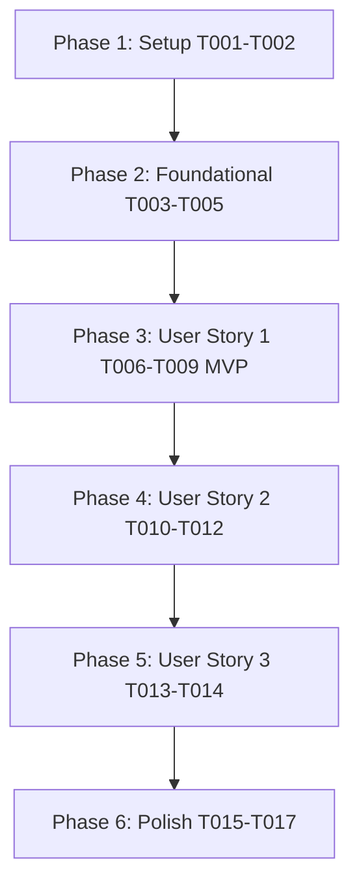

# Tasks: Freemium Course Exploration (`002-freemium-course-exploration`)

**Input**: Design documents from `/specs/002-freemium-course-exploration/`

**Prerequisites**: [plan.md](file:///D:/Projects%20IT/Project%20IT%20-%20Phanilie-New/specs/002-freemium-course-exploration/plan.md), [spec.md](file:///D:/Projects%20IT/Project%20IT%20-%20Phanilie-New/specs/002-freemium-course-exploration/spec.md), [research.md](file:///D:/Projects%20IT/Project%20IT%20-%20Phanilie-New/specs/002-freemium-course-exploration/research.md), [data-model.md](file:///D:/Projects%20IT/Project%20IT%20-%20Phanilie-New/specs/002-freemium-course-exploration/data-model.md), [course-api.md](file:///D:/Projects%20IT/Project%20IT%20-%20Phanilie-New/specs/002-freemium-course-exploration/contracts/course-api.md)

---

## Phase 1: Setup (Shared Infrastructure)

**Purpose**: Infrastructure setup for course exploration components

- [x] T001 [P] Create frontend API service client for courses in `frontend/src/services/courseApi.ts`
- [x] T002 [P] Create global Membership Modal Context in `frontend/src/context/MembershipModalContext.tsx`

---

## Phase 2: Foundational (Blocking Prerequisites)

**Purpose**: Core backend entities, DTOs, and services for course tree retrieval and paywall guard

- [x] T003 [P] Create Course DTO models in `backend/Models/CourseTreeDto.cs`
- [x] T004 Define `ICourseService` interface in `backend/Services/ICourseService.cs`
- [x] T005 Implement `CourseService` catalog provider in `backend/Services/CourseService.cs`

---

## Phase 3: User Story 1 - Public Course Tree Browsing (Priority: P1) 🎯 MVP

**Goal**: As a visitor or student, browse the full course tree organized by skill levels (Beginner, Intermediate, Advanced) and topic modules.

- [x] T006 [US1] Create Backend Public Course Tree API Endpoint (`GET /api/courses`) in `backend/Controllers/CourseController.cs`
- [x] T007 [P] [US1] Create Level Filter & Course Card Component in `frontend/src/components/CourseCard.tsx`
- [x] T008 [US1] Create Topic & Lesson Curriculum List Component in `frontend/src/components/CurriculumTree.tsx`
- [x] T009 [US1] Update `frontend/src/courses.tsx` to render dynamic course catalog data from `courseApi.ts`

---

## Phase 4: User Story 2 - Paywall Lock & Upgrade Modal Trigger (Priority: P2)

**Goal**: Block non-subscribers with HTTP 403 and present Membership Upgrade Modal with localized dual-currency pricing and auth redirection.

- [x] T010 [US2] Implement `PaywallGuard` middleware & media endpoint (`GET /api/lessons/{id}/media`) in `backend/Controllers/CourseController.cs`
- [x] T011 [P] [US2] Create Membership Upgrade Modal Component in `frontend/src/components/MembershipPlanModal.tsx`
- [x] T012 [US2] Wire Auth Guard check and "Subscribe Now" navigation logic in `frontend/src/components/MembershipPlanModal.tsx`

---

## Phase 5: User Story 3 - Unrestricted Subscriber Content Access (Priority: P3)

**Goal**: Allow active subscribers (`IsSubscribed = true`) to stream full HD lesson videos and download PDF sheet music without paywalls.

- [x] T013 [P] [US3] Create Subscriber Video Player & PDF Download Component in `frontend/src/components/LessonPlayerView.tsx`
- [x] T014 [US3] Integrate `LessonPlayerView` into `courses.tsx` and `layout.tsx` view router

---

## Phase 6: Polish & Cross-Cutting Concerns

**Purpose**: Verification, error handling, and build checks

- [x] T015 [P] Run frontend build validation (`npm run build`) in `frontend/`
- [x] T016 Run backend build validation (`dotnet build`) in `backend/`
- [x] T017 Run end-to-end quickstart validation scenarios from `specs/002-freemium-course-exploration/quickstart.md`

---

## Dependencies & Execution Order

