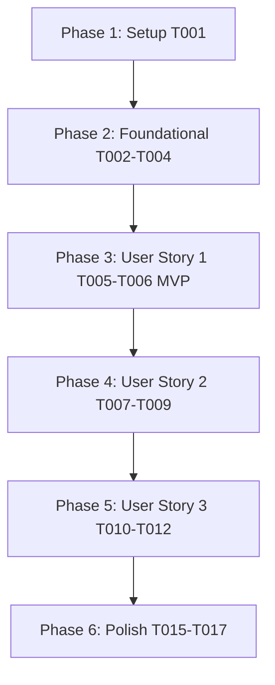

# Tasks: Pricing Localization & Payments (`003-pricing-localization-payments`)

**Input**: Design documents from `/specs/003-pricing-localization-payments/`

**Prerequisites**: [plan.md](file:///D:/Projects%20IT/Project%20IT%20-%20Phanilie-New/specs/003-pricing-localization-payments/plan.md), [spec.md](file:///D:/Projects%20IT/Project%20IT%20-%20Phanilie-New/specs/003-pricing-localization-payments/spec.md), [research.md](file:///D:/Projects%20IT/Project%20IT%20-%20Phanilie-New/specs/003-pricing-localization-payments/research.md), [data-model.md](file:///D:/Projects%20IT/Project%20IT%20-%20Phanilie-New/specs/003-pricing-localization-payments/data-model.md), [payment-api.md](file:///D:/Projects%20IT/Project%20IT%20-%20Phanilie-New/specs/003-pricing-localization-payments/contracts/payment-api.md)

---

## Phase 1: Setup (Shared Infrastructure)

**Purpose**: Infrastructure setup for payment gateway components

- [x] T001 [P] Create frontend payment service client in `frontend/src/services/paymentApi.ts`

---

## Phase 2: Foundational (Blocking Prerequisites)

**Purpose**: Core backend entities, strategy interfaces, and localization service

- [x] T002 [P] Create Checkout DTO models in `backend/Models/CheckoutRequestDto.cs`
- [x] T003 Define `IPaymentGateway` strategy interface in `backend/Services/IPaymentGateway.cs`
- [x] T004 Implement `LocalizationService` for Geo-IP/country currency mapping in `backend/Services/LocalizationService.cs`

---

## Phase 3: User Story 1 - Geo-IP Country & Currency Localization (Priority: P1) 🎯 MVP

**Goal**: Automatically detect country and format prices in IDR (Rp) for Indonesia and USD ($) for International buyers.

- [x] T005 [P] [US1] Create currency & price formatting utility helpers in `frontend/src/services/paymentApi.ts`
- [x] T006 [US1] Update `frontend/src/SubscriptionCheckout.tsx` to format localized prices dynamically

---

## Phase 4: User Story 2 - Indonesian Payment Processing via Midtrans (Priority: P2)

**Goal**: Implement Midtrans Snap payment gateway integration for IDR orders with QRIS, Bank Transfer, and E-Wallets.

- [x] T007 [P] [US2] Implement `MidtransPaymentGateway` in `backend/Services/MidtransPaymentGateway.cs`
- [x] T008 [US2] Create Payment Controller Endpoint (`POST /api/payments/checkout`) in `backend/Controllers/PaymentController.cs`
- [x] T009 [US2] Implement Midtrans Webhook receiver (`POST /api/payments/midtrans-webhook`) in `backend/Controllers/PaymentController.cs`

---

## Phase 5: User Story 3 - Global International Payment Processing via Stripe (Priority: P3)

**Goal**: Implement Stripe Checkout Session integration for USD international orders with Credit Cards and PayPal.

- [x] T010 [P] [US3] Implement `StripePaymentGateway` in `backend/Services/StripePaymentGateway.cs`
- [x] T011 [US3] Implement Stripe Webhook receiver (`POST /api/payments/stripe-webhook`) in `backend/Controllers/PaymentController.cs`
- [x] T012 [US3] Update `frontend/src/SubscriptionCheckout.tsx` to handle Stripe & Midtrans checkout response URLs

---

## Phase 6: Polish & Cross-Cutting Concerns

**Purpose**: Verification, error handling, and build checks

- [x] T015 [P] Run frontend build validation (`npm run build`) in `frontend/`
- [x] T016 Run backend build validation (`dotnet build`) in `backend/`
- [x] T017 Run end-to-end quickstart validation scenarios from `specs/003-pricing-localization-payments/quickstart.md`

---

## Dependencies & Execution Order

