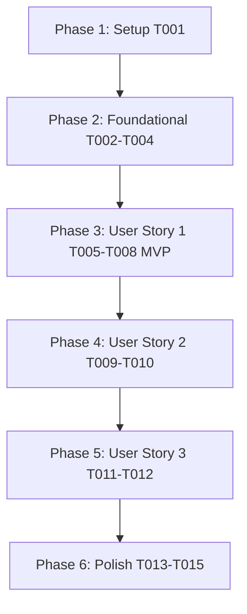

# Tasks: Digital Sheet Music Store & Library (`004-digital-sheet-music-store`)

**Input**: Design documents from `/specs/004-digital-sheet-music-store/`

**Prerequisites**: [plan.md](file:///D:/Projects%20IT/Project%20IT%20-%20Phanilie-New/specs/004-digital-sheet-music-store/plan.md), [spec.md](file:///D:/Projects%20IT/Project%20IT%20-%20Phanilie-New/specs/004-digital-sheet-music-store/spec.md), [research.md](file:///D:/Projects%20IT/Project%20IT%20-%20Phanilie-New/specs/004-digital-sheet-music-store/research.md), [data-model.md](file:///D:/Projects%20IT/Project%20IT%20-%20Phanilie-New/specs/004-digital-sheet-music-store/data-model.md), [store-api.md](file:///D:/Projects%20IT/Project%20IT%20-%20Phanilie-New/specs/004-digital-sheet-music-store/contracts/store-api.md)

---

## Phase 1: Setup (Shared Infrastructure)

**Purpose**: Infrastructure setup for sheet music store components

- [x] T001 [P] Create frontend API service client in `frontend/src/services/sheetMusicApi.ts`

---

## Phase 2: Foundational (Blocking Prerequisites)

**Purpose**: Core backend DTOs, interfaces, and service provider

- [x] T002 [P] Create Sheet Music DTO models in `backend/Models/SheetMusicDto.cs`
- [x] T003 Define `ISheetMusicService` interface in `backend/Services/ISheetMusicService.cs`
- [x] T004 Implement `SheetMusicService` provider in `backend/Services/SheetMusicService.cs`

---

## Phase 3: User Story 1 - Store Catalog & Watermarked Preview (Priority: P1) 🎯 MVP

**Goal**: Browse digital sheet music catalog with genre/difficulty filters and preview watermarked sample page.

- [x] T005 [US1] Create Backend Sheet Music API Endpoint (`GET /api/sheetmusic`) in `backend/Controllers/SheetMusicController.cs`
- [x] T006 [P] [US1] Create Sheet Music Store Card Component in `frontend/src/components/SheetMusicCard.tsx`
- [x] T007 [US1] Create Watermarked Preview & Viewer Modal in `frontend/src/components/SheetMusicViewerModal.tsx`
- [x] T008 [US1] Update `frontend/src/store.tsx` to render dynamic sheet music store catalog

---

## Phase 4: User Story 2 - A-La-Carte Purchase & Instant Unlock (Priority: P2)

**Goal**: Purchase individual sheet music items and instantly unlock them into personal library.

- [x] T009 [US2] Implement Sheet Music Unlock Endpoint (`POST /api/sheetmusic/{id}/unlock`) in `backend/Controllers/SheetMusicController.cs`
- [x] T010 [US2] Connect a-la-carte checkout trigger to `paymentApi.ts` in `frontend/src/store.tsx`

---

## Phase 5: User Story 3 - Personal Library & Interactive Score Viewer (Priority: P3)

**Goal**: View owned sheet music in personal library (`/my-library`) with zoom and page-turn controls.

- [x] T011 [P] [US3] Create Backend Library Endpoint (`GET /api/sheetmusic/library`) in `backend/Controllers/SheetMusicController.cs`
- [x] T012 [US3] Update `frontend/src/library.tsx` to render owned digital sheet music library and launch `SheetMusicViewerModal`

---

## Phase 6: Polish & Cross-Cutting Concerns

**Purpose**: Verification, error handling, and build checks

- [x] T013 [P] Run frontend build validation (`npm run build`) in `frontend/`
- [x] T014 Run backend build validation (`dotnet build`) in `backend/`
- [x] T015 Run end-to-end quickstart validation scenarios from `specs/004-digital-sheet-music-store/quickstart.md`

---

## Dependencies & Execution Order

