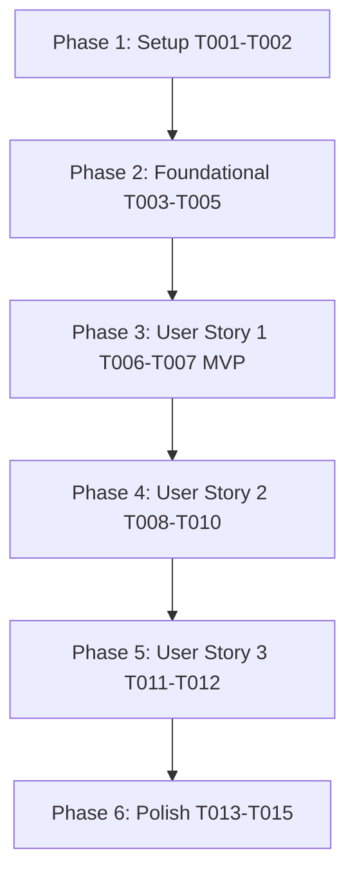

# Tasks: Interactive Practice Logger & Streaks (`005-interactive-practice-logger`)

**Input**: Design documents from `/specs/005-interactive-practice-logger/`

**Prerequisites**: [plan.md](file:///D:/Projects%20IT/Project%20IT%20-%20Phanilie-New/specs/005-interactive-practice-logger/plan.md), [spec.md](file:///D:/Projects%20IT/Project%20IT%20-%20Phanilie-New/specs/005-interactive-practice-logger/spec.md), [research.md](file:///D:/Projects%20IT/Project%20IT%20-%20Phanilie-New/specs/005-interactive-practice-logger/research.md), [data-model.md](file:///D:/Projects%20IT/Project%20IT%20-%20Phanilie-New/specs/005-interactive-practice-logger/data-model.md), [practice-api.md](file:///D:/Projects%20IT/Project%20IT%20-%20Phanilie-New/specs/005-interactive-practice-logger/contracts/practice-api.md)

---

## Phase 1: Setup (Shared Infrastructure)

**Purpose**: Infrastructure setup for practice logger components

- [x] T001 [P] Create frontend practice log API client in `frontend/src/services/practiceLogApi.ts`
- [x] T002 [P] Create live practice timer hook in `frontend/src/hooks/usePracticeTimer.ts`

---

## Phase 2: Foundational (Blocking Prerequisites)

**Purpose**: Core backend DTOs, interfaces, and service provider

- [x] T003 [P] Create Practice Log DTO models in `backend/Models/PracticeLogDto.cs`
- [x] T004 Define `IPracticeLogService` interface in `backend/Services/IPracticeLogService.cs`
- [x] T005 Implement `PracticeLogService` provider in `backend/Services/PracticeLogService.cs`

---

## Phase 3: User Story 1 - Live Stopwatch Practice Timer (Priority: P1) 🎯 MVP

**Goal**: Provide live stopwatch timer (Start, Pause, Resume, Reset, Stop & Save) for piano practice.

- [x] T006 [P] [US1] Create Practice Timer Widget Component in `frontend/src/components/PracticeTimerWidget.tsx`
- [x] T007 [US1] Integrate `PracticeTimerWidget` into `frontend/src/practiceLog.tsx`

---

## Phase 4: User Story 2 - Practice Streak & Weekly Heatmap Visualizer (Priority: P2)

**Goal**: Calculate active daily practice streak and render weekly day-of-week heatmap (Sun-Sat).

- [x] T008 [US2] Implement Streak Calculation Endpoint (`GET /api/practicelogs/streak`) in `backend/Controllers/PracticeLogController.cs`
- [x] T009 [P] [US2] Create Practice Streak & Heatmap Widget Component in `frontend/src/components/PracticeStreakWidget.tsx`
- [x] T010 [US2] Integrate `PracticeStreakWidget` into `frontend/src/practiceLog.tsx` and `frontend/src/dashboard.tsx`

---

## Phase 5: User Story 3 - Manual Log Entry & Practice History (Priority: P3)

**Goal**: Allow manual session log entry and searchable practice history feed.

- [x] T011 [US3] Implement Get & Create Practice Log Endpoints (`GET & POST /api/practicelogs`) in `backend/Controllers/PracticeLogController.cs`
- [x] T012 [US3] Update `frontend/src/practiceLogs.tsx` with keyword search and real-time history sync

---

## Phase 6: Polish & Cross-Cutting Concerns

**Purpose**: Verification, error handling, and build checks

- [x] T013 [P] Run frontend build validation (`npm run build`) in `frontend/`
- [x] T014 Run backend build validation (`dotnet build`) in `backend/`
- [x] T015 Run end-to-end quickstart validation scenarios from `specs/005-interactive-practice-logger/quickstart.md`

---

## Dependencies & Execution Order

