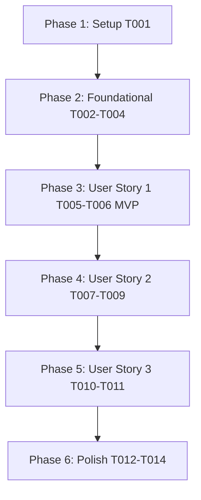

# Tasks: Student Achievement Badges & Gamification (`006-achievement-badges-gamification`)

**Input**: Design documents from `/specs/006-achievement-badges-gamification/`

**Prerequisites**: [plan.md](file:///D:/Projects%20IT/Project%20IT%20-%20Phanilie-New/specs/006-achievement-badges-gamification/plan.md), [spec.md](file:///D:/Projects%20IT/Project%20IT%20-%20Phanilie-New/specs/006-achievement-badges-gamification/spec.md), [research.md](file:///D:/Projects%20IT/Project%20IT%20-%20Phanilie-New/specs/006-achievement-badges-gamification/research.md), [data-model.md](file:///D:/Projects%20IT/Project%20IT%20-%20Phanilie-New/specs/006-achievement-badges-gamification/data-model.md), [badge-api.md](file:///D:/Projects%20IT/Project%20IT%20-%20Phanilie-New/specs/006-achievement-badges-gamification/contracts/badge-api.md)

---

## Phase 1: Setup (Shared Infrastructure)

**Purpose**: Infrastructure setup for achievement badge components

- [x] T001 [P] Create frontend badge API service client in `frontend/src/services/badgeApi.ts`

---

## Phase 2: Foundational (Blocking Prerequisites)

**Purpose**: Core backend DTOs, interfaces, and service provider

- [x] T002 [P] Create Badge DTO models in `backend/Models/UserBadgeDto.cs`
- [x] T003 Define `IBadgeService` interface in `backend/Services/IBadgeService.cs`
- [x] T004 Implement `BadgeService` evaluator in `backend/Services/BadgeService.cs`

---

## Phase 3: User Story 1 - System Achievement Badge Unlocking & Celebration Modal (Priority: P1) 🎯 MVP

**Goal**: Award badges when milestones are reached and display an animated celebration modal popup.

- [x] T005 [P] [US1] Create Badge Unlock Celebration Modal in `frontend/src/components/BadgeCelebrationModal.tsx`
- [x] T006 [US1] Create Badge Evaluation Controller Endpoint (`POST /api/badges/evaluate`) in `backend/Controllers/BadgeController.cs`

---

## Phase 4: User Story 2 - Student Profile & Dashboard Badge Showcase (Priority: P2)

**Goal**: Display unlocked badges and progress bars for locked badges in a showcase grid.

- [x] T007 [P] [US2] Create Badge Showcase Widget Component in `frontend/src/components/BadgeShowcaseWidget.tsx`
- [x] T008 [US2] Create User Badges API Endpoint (`GET /api/badges/user`) in `backend/Controllers/BadgeController.cs`
- [x] T009 [US2] Integrate `BadgeShowcaseWidget` into `frontend/src/dashboard.tsx`

---

## Phase 5: User Story 3 - Milestone Criteria Evaluation Engine (Priority: P3)

**Goal**: Evaluate `LessonCount`, `PracticeMinutes`, and `StreakDays` rules automatically without duplicate unlocks.

- [x] T010 [US3] Connect automatic badge evaluation to lesson completion in `backend/Services/CourseService.cs`
- [x] T011 [US3] Connect automatic badge evaluation to practice log creation in `backend/Services/PracticeLogService.cs`

---

## Phase 6: Polish & Cross-Cutting Concerns

**Purpose**: Verification, error handling, and build checks

- [x] T012 [P] Run frontend build validation (`npm run build`) in `frontend/`
- [x] T013 Run backend build validation (`dotnet build`) in `backend/`
- [x] T014 Run end-to-end quickstart validation scenarios from `specs/006-achievement-badges-gamification/quickstart.md`

---

## Dependencies & Execution Order

