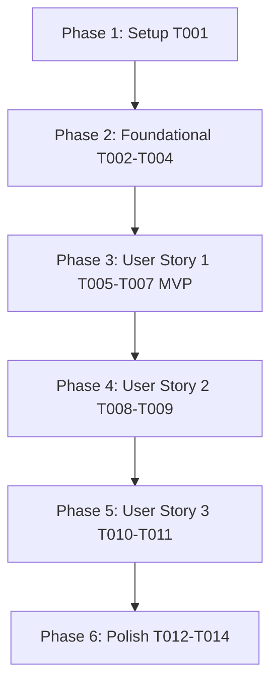

# Tasks: Community Discussion Forums (`007-community-discussion-forums`)

**Input**: Design documents from `/specs/007-community-discussion-forums/`

**Prerequisites**: [plan.md](file:///D:/Projects%20IT/Project%20IT%20-%20Phanilie-New/specs/007-community-discussion-forums/plan.md), [spec.md](file:///D:/Projects%20IT/Project%20IT%20-%20Phanilie-New/specs/007-community-discussion-forums/spec.md), [research.md](file:///D:/Projects%20IT/Project%20IT%20-%20Phanilie-New/specs/007-community-discussion-forums/research.md), [data-model.md](file:///D:/Projects%20IT/Project%20IT%20-%20Phanilie-New/specs/007-community-discussion-forums/data-model.md), [forum-api.md](file:///D:/Projects%20IT/Project%20IT%20-%20Phanilie-New/specs/007-community-discussion-forums/contracts/forum-api.md)

---

## Phase 1: Setup (Shared Infrastructure)

**Purpose**: Infrastructure setup for forum components

- [x] T001 [P] Create frontend forum API service client in `frontend/src/services/forumApi.ts`

---

## Phase 2: Foundational (Blocking Prerequisites)

**Purpose**: Core backend DTOs, interfaces, and service provider

- [x] T002 [P] Create Forum DTO models in `backend/Models/ForumThreadDto.cs`
- [x] T003 Define `IForumService` interface in `backend/Services/IForumService.cs`
- [x] T004 Implement `ForumService` provider in `backend/Services/ForumService.cs`

---

## Phase 3: User Story 1 - Forum Category Channel Browsing (Priority: P1) 🎯 MVP

**Goal**: Browse discussion threads filtered by channel categories (`Technique`, `Repertoire`, `Equipment`, `General`).

- [x] T005 [P] [US1] Create Forum Thread Card Component in `frontend/src/components/ForumThreadCard.tsx`
- [x] T006 [US1] Create Get Forum Threads API Endpoint (`GET /api/forum/threads`) in `backend/Controllers/ForumController.cs`
- [x] T007 [US1] Update `frontend/src/forums.tsx` to render category channel filter tabs and dynamic thread feed

---

## Phase 4: User Story 2 - Thread Creation & Discussion Replies (Priority: P2)

**Goal**: Allow students to create new discussion topics and post replies.

- [x] T008 [P] [US2] Create New Thread Modal Component in `frontend/src/components/CreateThreadModal.tsx`
- [x] T009 [US2] Implement Create Thread & Post Reply API Endpoints (`POST /api/forum/threads` & `POST /api/forum/threads/{id}/replies`) in `backend/Controllers/ForumController.cs`

---

## Phase 5: User Story 3 - Upvoting & Moderation Flagging (Priority: P3)

**Goal**: Enable upvoting threads and reporting inappropriate content.

- [x] T010 [P] [US3] Create Report Thread Modal Component in `frontend/src/components/ReportThreadModal.tsx`
- [x] T011 [US3] Implement Upvote & Report API Endpoints (`POST /api/forum/threads/{id}/upvote` & `POST /api/forum/threads/{id}/report`) in `backend/Controllers/ForumController.cs`

---

## Phase 6: Polish & Cross-Cutting Concerns

**Purpose**: Verification, error handling, and build checks

- [x] T012 [P] Run frontend build validation (`npm run build`) in `frontend/`
- [x] T013 Run backend build validation (`dotnet build`) in `backend/`
- [x] T014 Run end-to-end quickstart validation scenarios from `specs/007-community-discussion-forums/quickstart.md`

---

## Dependencies & Execution Order

