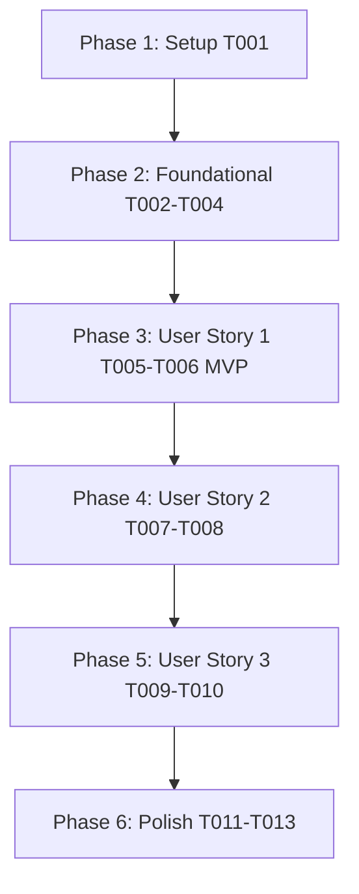

# Tasks: Personalized Learning Dashboard & Recommendations (`008-personalized-dashboard-recommendations`)

**Input**: Design documents from `/specs/008-personalized-dashboard-recommendations/`

**Prerequisites**: [plan.md](file:///D:/Projects%20IT/Project%20IT%20-%20Phanilie-New/specs/008-personalized-dashboard-recommendations/plan.md), [spec.md](file:///D:/Projects%20IT/Project%20IT%20-%20Phanilie-New/specs/008-personalized-dashboard-recommendations/spec.md), [research.md](file:///D:/Projects%20IT/Project%20IT%20-%20Phanilie-New/specs/008-personalized-dashboard-recommendations/research.md), [data-model.md](file:///D:/Projects%20IT/Project%20IT%20-%20Phanilie-New/specs/008-personalized-dashboard-recommendations/data-model.md), [dashboard-api.md](file:///D:/Projects%20IT/Project%20IT%20-%20Phanilie-New/specs/008-personalized-dashboard-recommendations/contracts/dashboard-api.md)

---

## Phase 1: Setup (Shared Infrastructure)

**Purpose**: Infrastructure setup for dashboard metrics & recommendation components

- [x] T001 [P] Create frontend dashboard API service client in `frontend/src/services/dashboardApi.ts`

---

## Phase 2: Foundational (Blocking Prerequisites)

**Purpose**: Core backend DTOs, interfaces, and service provider

- [x] T002 [P] Create Dashboard DTO models in `backend/Models/DashboardSummaryDto.cs`
- [x] T003 Define `IDashboardService` interface in `backend/Services/IDashboardService.cs`
- [x] T004 Implement `DashboardService` provider in `backend/Services/DashboardService.cs`

---

## Phase 3: User Story 1 - Overall Mastery & Learning Progress Metrics (Priority: P1) 🎯 MVP

**Goal**: Display circular SVG overall progress mastery meter, completed lesson count, practice time, and XP.

- [x] T005 [US1] Create Get Dashboard Summary API Endpoint (`GET /api/dashboard/summary`) in `backend/Controllers/DashboardController.cs`
- [x] T006 [US1] Update Overall Progress section in `frontend/src/dashboard.tsx` with dynamic API sync

---

## Phase 4: User Story 2 - Next Recommended Lesson Engine Widget (Priority: P2)

**Goal**: Calculate next incomplete lesson in curriculum and render "Continue Learning" action card.

- [x] T007 [P] [US2] Create Next Recommended Lesson Card Component in `frontend/src/components/NextRecommendedLessonCard.tsx`
- [x] T008 [US2] Integrate `NextRecommendedLessonCard` into `frontend/src/dashboard.tsx` with direct jump navigation

---

## Phase 5: User Story 3 - Interactive Student To-Do Checklist & Saved Items (Priority: P3)

**Goal**: Allow students to manage practice to-do checklist and saved study bookmarks.

- [x] T009 [US3] Implement Get & Create To-Do API Endpoints (`GET & POST /api/dashboard/todos`) in `backend/Controllers/DashboardController.cs`
- [x] T010 [US3] Connect To-Do checklist & Saved for Later list sync in `frontend/src/dashboard.tsx`

---

## Phase 6: Polish & Cross-Cutting Concerns

**Purpose**: Verification, error handling, and build checks

- [x] T011 [P] Run frontend build validation (`npm run build`) in `frontend/`
- [x] T012 Run backend build validation (`dotnet build`) in `backend/`
- [x] T013 Run end-to-end quickstart validation scenarios from `specs/008-personalized-dashboard-recommendations/quickstart.md`

---

## Dependencies & Execution Order

