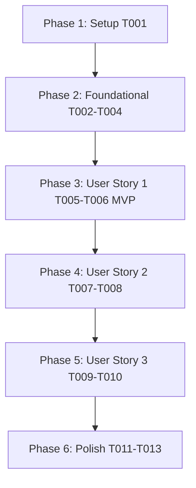

# Tasks: User Profile & Account Management (`009-user-profile-account-management`)

**Input**: Design documents from `/specs/009-user-profile-account-management/`

**Prerequisites**: [plan.md](file:///D:/Projects%20IT/Project%20IT%20-%20Phanilie-New/specs/009-user-profile-account-management/plan.md), [spec.md](file:///D:/Projects%20IT/Project%20IT%20-%20Phanilie-New/specs/009-user-profile-account-management/spec.md), [research.md](file:///D:/Projects%20IT/Project%20IT%20-%20Phanilie-New/specs/009-user-profile-account-management/research.md), [data-model.md](file:///D:/Projects%20IT/Project%20IT%20-%20Phanilie-New/specs/009-user-profile-account-management/data-model.md), [profile-api.md](file:///D:/Projects%20IT/Project%20IT%20-%20Phanilie-New/specs/009-user-profile-account-management/contracts/profile-api.md)

---

## Phase 1: Setup (Shared Infrastructure)

**Purpose**: Infrastructure setup for user profile & account management

- [x] T001 [P] Create frontend profile API service client in `frontend/src/services/profileApi.ts`

---

## Phase 2: Foundational (Blocking Prerequisites)

**Purpose**: Core backend DTOs, interfaces, and service provider

- [x] T002 [P] Create User Profile DTO models in `backend/Models/UserProfileDto.cs`
- [x] T003 Define `IProfileService` interface in `backend/Services/IProfileService.cs`
- [x] T004 Implement `ProfileService` provider in `backend/Services/ProfileService.cs`

---

## Phase 3: User Story 1 - Profile Details & Musical Preferences (Priority: P1) 🎯 MVP

**Goal**: Allow students to edit their profile details (name, avatar, bio, skill level, and preferred genres).

- [x] T005 [US1] Create Get & Update Profile API Endpoints (`GET & PUT /api/user/profile`) in `backend/Controllers/ProfileController.cs`
- [x] T006 [P] [US1] Create User Profile View Component in `frontend/src/userProfile.tsx`

---

## Phase 4: User Story 2 - Subscription Status & Membership Plan Overview (Priority: P2)

**Goal**: Display active subscription tier, renewal date, and billing history overview.

- [x] T007 [US2] Create Subscription Overview API Endpoint (`GET /api/user/subscription`) in `backend/Controllers/ProfileController.cs`
- [x] T008 [US2] Integrate Subscription Overview tab into `frontend/src/userProfile.tsx`

---

## Phase 5: User Story 3 - Account Security & Notification Preferences (Priority: P3)

**Goal**: Enable secure password changes and notification preference toggles.

- [x] T009 [US3] Implement Change Password API Endpoint (`POST /api/user/change-password`) in `backend/Controllers/ProfileController.cs`
- [x] T010 [US3] Integrate Security & Password tab into `frontend/src/userProfile.tsx`

---

## Phase 6: Polish & Cross-Cutting Concerns

**Purpose**: Verification, error handling, and build checks

- [x] T011 [P] Run frontend build validation (`npm run build`) in `frontend/`
- [x] T012 Run backend build validation (`dotnet build`) in `backend/`
- [x] T013 Run end-to-end quickstart validation scenarios from `specs/009-user-profile-account-management/quickstart.md`

---

## Dependencies & Execution Order

