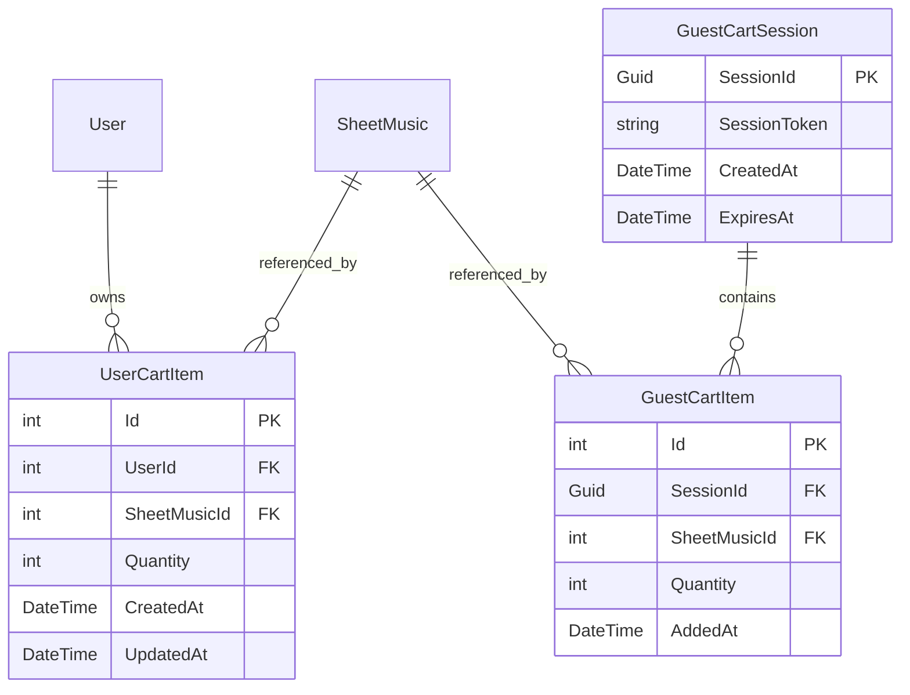

# Data Model: Shopping Cart & Guest Sync

**Module**: `SPEC-010 Shopping Cart & Guest Sync`  
**Date**: 2026-08-11  
**Status**: Complete Phase 1 Design  

---

## 1. Database Schema & Entities

### 1.1 GuestCartSession Entity
Represents an unauthenticated guest user session tracked via HTTP-only cookie (`phanilie_guest_session`).

| Column | Type | Constraints | Description |
| :--- | :--- | :--- | :--- |
| `SessionId` | `Guid` | PK, Required | Unique identifier for guest cart session |
| `SessionToken` | `string` | Unique, Index | Cryptographic token stored in HTTP-only cookie |
| `CreatedAt` | `DateTime` | Required | Session creation timestamp (UTC) |
| `ExpiresAt` | `DateTime` | Required, Index | Session expiration timestamp (30-day TTL) |

### 1.2 GuestCartItem Entity
Line item stored in guest cart session prior to authentication.

| Column | Type | Constraints | Description |
| :--- | :--- | :--- | :--- |
| `Id` | `int` | PK, Auto-increment | Unique line item ID |
| `SessionId` | `Guid` | FK -> GuestCartSession, Index | Owning guest session |
| `SheetMusicId` | `int` | FK -> SheetMusic, Index | Selected sheet music product |
| `Quantity` | `int` | Required, Default: 1 | Item quantity |
| `AddedAt` | `DateTime` | Required | Timestamp when added (UTC) |

### 1.3 UserCartItem Entity
Line item stored in database cart for authenticated student accounts.

| Column | Type | Constraints | Description |
| :--- | :--- | :--- | :--- |
| `Id` | `int` | PK, Auto-increment | Unique line item ID |
| `UserId` | `int` | FK -> User, Index | Owning authenticated student ID |
| `SheetMusicId` | `int` | FK -> SheetMusic, Index | Selected sheet music product |
| `Quantity` | `int` | Required, Default: 1 | Item quantity |
| `CreatedAt` | `DateTime` | Required | Timestamp created (UTC) |
| `UpdatedAt` | `DateTime` | Required | Timestamp last updated (UTC) |

---

## 2. Relationships & Constraints



### Uniqueness & Business Rules
- **Unique Cart Item per User**: Index `(UserId, SheetMusicId)` enforces max 1 line item per sheet music product per user.
- **Unique Cart Item per Guest Session**: Index `(SessionId, SheetMusicId)` enforces max 1 line item per sheet music product per guest session.
- **Quantity Bounds**: `Quantity` must be between `1` and `10` (digital licenses default to 1).

---

## 3. Data Transfer Objects (DTOs)

### `CartDto`
```json
{
  "totalItemCount": 2,
  "subtotalIDR": 300000.0,
  "subtotalUSD": 19.98,
  "currency": "IDR",
  "hasPriceAdjustments": false,
  "items": [
    {
      "cartItemId": 12,
      "sheetMusicId": 104,
      "title": "Fantaisie-Impromptu in C# Minor",
      "composer": "Frédéric Chopin",
      "coverImageUrl": "/images/sheets/chopin-fantaisie.png",
      "unitPriceIDR": 150000.0,
      "unitPriceUSD": 9.99,
      "quantity": 1,
      "lineTotalIDR": 150000.0,
      "lineTotalUSD": 9.99,
      "isPriceAdjusted": false,
      "previousPriceIDR": null,
      "previousPriceUSD": null
    }
  ]
}
```

### `SyncCartRequestDto`
Empty payload (uses HTTP-only guest session cookie `phanilie_guest_session` and user JWT token header).

### `AddToCartDto`
```json
{
  "sheetMusicId": 104,
  "quantity": 1
}
```

### `UpdateCartItemDto`
```json
{
  "quantity": 2
}
```
