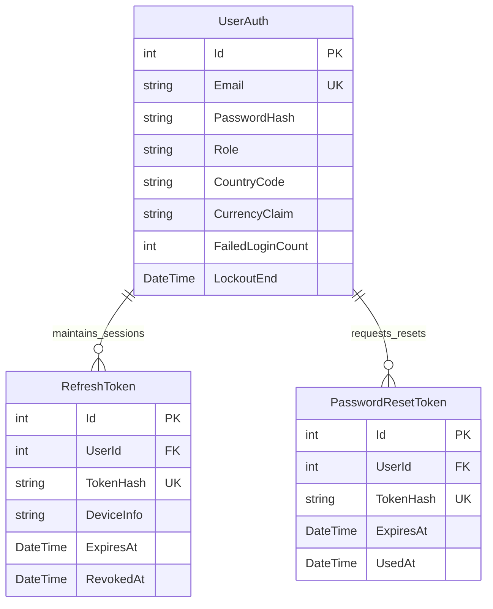

# Data Model: Auth & Country Localization

**Module**: `SPEC-011 Auth & Country Localization`  
**Date**: 2026-08-11  
**Status**: Complete Phase 1 Design  

---

## 1. Database Schema & Entities

### 1.1 `UserAuth` (Extends `User` Entity)
Stores core credentials, role, country preference, currency claim, and brute-force security state.

| Column | Type | Constraints | Description |
| :--- | :--- | :--- | :--- |
| `Id` | `int` | PK, Auto-increment | Unique User ID |
| `Email` | `string` | Unique, Index, Required | User email address |
| `FullName` | `string` | Required | Student display name |
| `PasswordHash` | `string` | Required | BCrypt hashed password (work factor 11) |
| `Role` | `string` | Required, Default: `"Student"` | Role claim (`"Student"`, `"Admin"`) |
| `CountryCode` | `string` | Required, Default: `"ID"` | 2-letter ISO country code (`"ID"`, `"US"`) |
| `CurrencyClaim` | `string` | Required | Assigned currency (`"IDR"` if ID, else `"USD"`) |
| `FailedLoginCount`| `int` | Default: `0` | Consecutive failed login attempts |
| `LockoutEnd` | `DateTime?` | Nullable | Lockout expiration timestamp (15-min duration) |
| `CreatedAt` | `DateTime` | Required | User registration timestamp (UTC) |
| `LastLoginAt` | `DateTime?` | Nullable | Timestamp of last successful sign in |

### 1.2 `RefreshToken` Entity
Tracks active multi-device sessions and supports token rotation & revocation.

| Column | Type | Constraints | Description |
| :--- | :--- | :--- | :--- |
| `Id` | `int` | PK, Auto-increment | Primary Key |
| `UserId` | `int` | FK -> User, Index | Owning user ID |
| `TokenHash` | `string` | Unique, Index, Required | SHA-256 hash of refresh token string |
| `DeviceInfo` | `string` | Optional | User agent / device descriptor |
| `CreatedAt` | `DateTime` | Required | Session creation timestamp |
| `ExpiresAt` | `DateTime` | Required, Index | Session expiration (7 days from creation) |
| `RevokedAt` | `DateTime?` | Nullable | Revocation timestamp (null if active) |
| `ReplacedByTokenHash` | `string?` | Nullable | SHA-256 hash of replacement token upon rotation |

### 1.3 `PasswordResetToken` Entity
Single-use time-limited tokens for self-service password recovery and early lockout clearance.

| Column | Type | Constraints | Description |
| :--- | :--- | :--- | :--- |
| `Id` | `int` | PK, Auto-increment | Primary Key |
| `UserId` | `int` | FK -> User, Index | Target user ID |
| `TokenHash` | `string` | Unique, Index, Required | SHA-256 hash of URL reset token |
| `CreatedAt` | `DateTime` | Required | Token creation timestamp |
| `ExpiresAt` | `DateTime` | Required, Index | Expiration timestamp (1 hour TTL) |
| `UsedAt` | `DateTime?` | Nullable | Timestamp when consumed |

---

## 2. Relationships & Entity Diagram



---

## 3. Data Transfer Objects (DTOs)

### `AuthResponseDto`
```json
{
  "token": "eyJhbGciOiJIUzI1NiIsInR5cCI6IkpXVCJ9...",
  "expiresAt": "2026-08-11T14:50:00Z",
  "user": {
    "id": 42,
    "email": "student@phaniliemusic.com",
    "fullName": "Stephanie Halim",
    "role": "Student",
    "countryCode": "ID",
    "currency": "IDR"
  }
}
```

### `RegisterDto`
```json
{
  "fullName": "Stephanie Halim",
  "email": "student@phaniliemusic.com",
  "password": "SecurePassword123!",
  "countryCode": "ID"
}
```

### `LoginDto`
```json
{
  "email": "student@phaniliemusic.com",
  "password": "SecurePassword123!"
}
```

### `GeoLocationDto`
```json
{
  "countryCode": "ID",
  "countryName": "Indonesia",
  "suggestedCurrency": "IDR"
}
```
