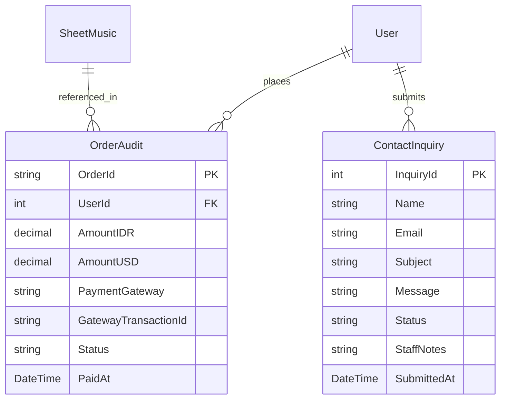

# Data Model: Admin CRUD Management

**Module**: `SPEC-012 Admin CRUD Management`  
**Date**: 2026-08-11  
**Status**: Complete Phase 1 Design  

---

## 1. Administrative DTO Schemas & Data Structures

### 1.1 `AdminDashboardSummaryDto`
High-level platform metrics displayed on the admin control panel overview dashboard.

| Property | Type | Description |
| :--- | :--- | :--- |
| `TotalRevenueIDR` | `decimal` | Total settled revenue in Indonesian Rupiah |
| `TotalRevenueUSD` | `decimal` | Total settled revenue in US Dollars |
| `TotalStudents` | `int` | Total registered student accounts |
| `ActiveSubscribers` | `int` | Count of active premium subscribers |
| `TotalOrders` | `int` | Total completed transactions |
| `PendingInquiries` | `int` | Count of unresolved support inquiries |

### 1.2 `PagedRequestDto` & `PagedResultDto<T>`
Generic pagination and search contract for all admin list tables.

#### `PagedRequestDto`
```json
{
  "pageNumber": 1,
  "pageSize": 20,
  "searchTerm": "Chopin",
  "sortBy": "CreatedAt",
  "sortDescending": true
}
```

#### `PagedResultDto<T>`
```json
{
  "items": [],
  "totalCount": 142,
  "pageNumber": 1,
  "pageSize": 20,
  "totalPages": 8,
  "hasPreviousPage": false,
  "hasNextPage": true
}
```

---

## 2. Entity Management DTOs

### 2.1 `AdminSheetMusicDto` / `CreateSheetMusicDto`
```json
{
  "title": "Fantaisie-Impromptu in C# Minor, Op. 66",
  "composer": "Frédéric Chopin",
  "instrument": "Piano",
  "difficulty": "Advanced",
  "priceIDR": 150000.0,
  "priceUSD": 9.99,
  "coverImageUrl": "/images/sheets/chopin-fantaisie.png",
  "pdfScoreUrl": "/protected/scores/chopin-fantaisie.pdf",
  "audioPreviewUrl": "/media/audio/chopin-fantaisie-preview.mp3",
  "isPublished": true,
  "isArchived": false
}
```

### 2.2 `AdminCourseDto` / `CreateCourseDto`
```json
{
  "title": "Mastering Classical Piano Technique",
  "description": "Comprehensive course covering scales, arpeggios, and expressive phrasing.",
  "difficultyLevel": "Intermediate",
  "thumbnailUrl": "/images/courses/classical-technique.png",
  "priceIDR": 450000.0,
  "priceUSD": 29.99,
  "isPublished": true,
  "isArchived": false
}
```

### 2.3 `AdminOrderAuditDto`
```json
{
  "orderId": "ORD-20260811-0042",
  "customerEmail": "student@phaniliemusic.com",
  "customerName": "Stephanie Halim",
  "itemSummary": "Chopin Fantaisie-Impromptu Sheet Music",
  "amountIDR": 150000.0,
  "amountUSD": 9.99,
  "currency": "IDR",
  "paymentGateway": "Midtrans",
  "gatewayTransactionId": "MID-TRX-998822",
  "status": "Settled",
  "paidAt": "2026-08-11T12:30:00Z"
}
```

### 2.4 `AdminInquiryDto` / `UpdateInquiryStatusDto`
```json
{
  "inquiryId": 18,
  "name": "David Tan",
  "email": "david@example.com",
  "subject": "Payment issue on sheet music purchase",
  "message": "My card was charged but download link expired.",
  "status": "Pending",
  "staffNotes": "Investigating Midtrans transaction logs",
  "submittedAt": "2026-08-11T11:00:00Z"
}
```

---

## 3. Entity Relationships Diagram


