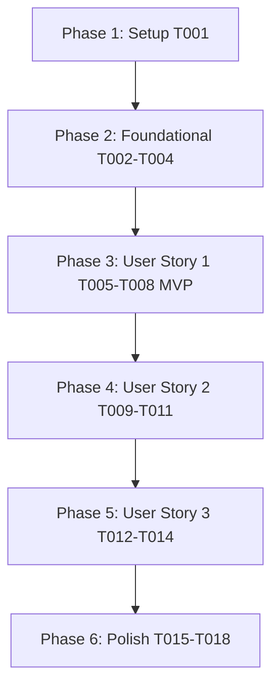

# Tasks: Media File Storage (`013-media-file-storage`)

**Input**: Design documents from `/specs/013-media-file-storage/`

**Prerequisites**: [plan.md](file:///d:/Projects%20IT/Project%20IT%20-%20Phanilie-New/specs/013-media-file-storage/plan.md), [spec.md](file:///d:/Projects%20IT/Project%20IT%20-%20Phanilie-New/specs/013-media-file-storage/spec.md), [research.md](file:///d:/Projects%20IT/Project%20IT%20-%20Phanilie-New/specs/013-media-file-storage/research.md), [data-model.md](file:///d:/Projects%20IT/Project%20IT%20-%20Phanilie-New/specs/013-media-file-storage/data-model.md), [media-api.md](file:///d:/Projects%20IT/Project%20IT%20-%20Phanilie-New/specs/013-media-file-storage/contracts/media-api.md)

---

## Phase 1: Setup (Shared Infrastructure)

**Purpose**: Frontend API client setup for media operations

- [x] T001 Create frontend media API service client in `frontend/src/services/mediaApi.ts`

---

## Phase 2: Foundational (Blocking Prerequisites)

**Purpose**: Core EF Core models, DTOs, and storage strategy interface

- [x] T002 [P] Create `StoredMediaFile` EF Core entity & DB set registration in `backend/Models/StoredMediaFile.cs` and `backend/Data/ApplicationDbContext.cs`
- [x] T003 [P] Create Media DTO models (`MediaUploadDto`, `MediaFileResponseDto`, `SignedTokenResponseDto`) in `backend/Models/MediaUploadDto.cs`
- [x] T004 Define `IStorageService` interface in `backend/Services/IStorageService.cs`

---

## Phase 3: User Story 1 - Secure Media File Upload & Validation (Priority: P1) 🎯 MVP

**Goal**: Allow Admin Manager to upload PDF scores, MP3 previews, thumbnail images, and MP4 videos with magic-byte MIME header validation and strict byte size limit enforcement.

- [x] T005 [US1] Create magic-byte MIME header inspection & file validation service in `backend/Services/MediaValidationService.cs`
- [x] T006 [US1] Implement Media Controller upload endpoint (`POST /api/media/upload`) in `backend/Controllers/MediaController.cs`
- [x] T007 [P] [US1] Build drag-and-drop file uploader UI component with real-time progress bar in `frontend/src/components/MediaUploader.tsx`
- [x] T008 [P] [US1] Build media player & image preview UI component in `frontend/src/components/MediaPreviewPlayer.tsx`

---

## Phase 4: User Story 2 - Transparent Storage Strategy & Provider Switching (Priority: P2)

**Goal**: Enable seamless switching between local disk storage (offline/dev) and Supabase Cloud Storage (prod) without breaking media access.

- [x] T009 [US2] Implement `LocalStorageService` provider in `backend/Services/LocalStorageService.cs`
- [x] T010 [US2] Implement `SupabaseStorageService` provider in `backend/Services/SupabaseStorageService.cs`
- [x] T011 [US2] Register `IStorageService` strategy factory in `backend/Program.cs` configured via `appsettings.json`

---

## Phase 5: User Story 3 - Protected Asset Streaming & Short-Lived Access Tokens (Priority: P3)

**Goal**: Enable HMAC signed 5-minute access tokens and HTTP Range media streaming buffers for protected PDF scores and lesson videos.

- [x] T012 [US3] Implement HMAC-SHA256 token generator & validator service in `backend/Services/MediaTokenService.cs`
- [x] T013 [US3] Create token generation endpoint (`GET /api/media/token/{fileId}`) & attach entity endpoint (`POST /api/media/attach`) in `backend/Controllers/MediaController.cs`
- [x] T014 [US3] Implement Range-supported media streaming endpoint (`GET /api/media/stream/{fileId}`) in `backend/Controllers/MediaController.cs`

---

## Phase 6: Polish & Cross-Cutting Concerns

**Purpose**: Background cleanup task, build checks, and end-to-end quickstart validation

- [x] T015 [P] Implement background 24-hour orphaned file cleanup hosted service in `backend/Services/OrphanedMediaCleanupService.cs`
- [x] T016 [P] Run frontend build validation (`npm run build`) in `frontend/`
- [x] T017 Run backend build validation (`dotnet build`) in `backend/`
- [x] T018 Run end-to-end quickstart validation scenarios from `specs/013-media-file-storage/quickstart.md`

---

## Dependencies & Execution Order

---

## Parallel Execution Opportunities

- **T002 & T003**: Entity creation (`StoredMediaFile.cs`) and DTO creation (`MediaUploadDto.cs`) can run in parallel.
- **T007 & T008**: Frontend uploader component (`MediaUploader.tsx`) and preview component (`MediaPreviewPlayer.tsx`) can be built concurrently.
- **T015 & T016**: Background cleanup service (`OrphanedMediaCleanupService.cs`) and frontend build check (`npm run build`) can run independently.
